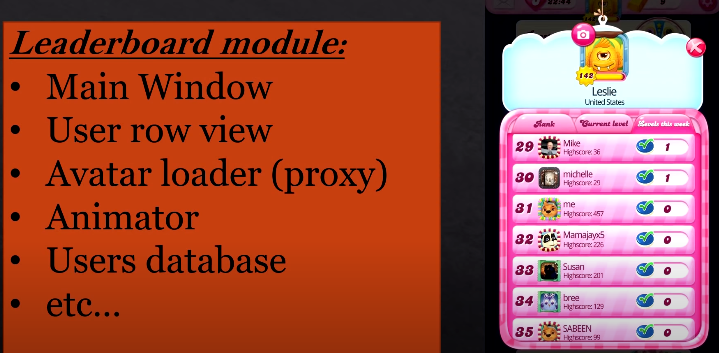
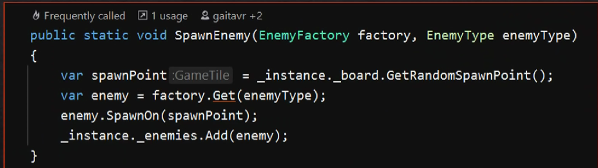
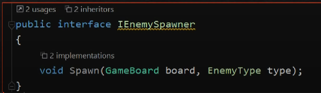
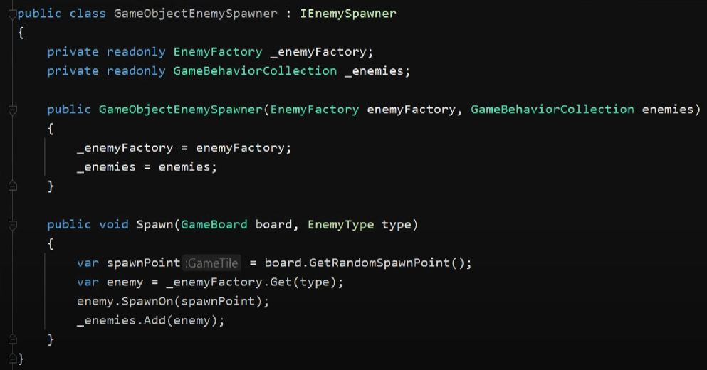

**ООП**

## Главное

* Инкапсулируйте все, что может изменяться;
* Уделяйте больше внимания интерфейсам, а не их реализациям;
* Каждый класс в вашем приложении должен иметь только одно назначение;
* Классы — это их поведение и функциональность.

---

* Абстракция — отделение концепции от ее экземпляра;
* Полиморфизм — реализация задач одной и той же идеи разными способами;
* Наследование — способность объекта или класса базироваться на другом объекте или классе. Это главный механизм для повторного использования кода. Наследственное отношение классов четко определяет их иерархию;
* Инкапсуляция — размещение одного объекта или класса внутри другого для разграничения доступа к ним.

---

## Наследование

Классы наследуют какие-то характеристики от другого класса.

**Например,** у нас есть класс **человек** , внутри которого есть какие-то данные (имя, пол, возраст и т.д.),  а еще какие-то функции, например, функция **ходьбы**.

Но младенец, взрослый и старик будут ходить по-разному. Но все они могут быть опмисаны одним классом человек (т.к. у них одни и те же параметры и функции), но некоторые функции у них работают по-разному. Можно ввести отдельные классы Младенец, Взрослый и Старик, которые унаследуют класс Человек, но внутри каждого класса будет реализована своя функция ходьбы.

```
Chelovek [] obj = new Chelovek[]
{
    new Mladenec
    new Vzroslyi
    new Starik

    GameLoop()
    {
        foreach (Chelovek o in obj)
        o.Walking();
    }
}
```

## Полиморфизм

```
 GameLoop()
    {
        foreach (Chelovek o in obj)
        o.Walking();
    }
```

Вызываем одну и ту же функцию, которая выполняет одну и ту же задачу. Из этой части программы она выглядит как функция Walking, хотя внутри у нас 3 разных реализации.

## Инкапсуляиця

Все параметры должны находиться внутри объекта. В некоторых языках программирования Сокрытие является частью инкапсуляции (модификаторы доступа паблик, протектед и т.д.).

---

## Не повторяйся (Don’t repeat yourself — DRY)

Избегайте повторного написания кода, вынося в абстракции часто используемые задачи и данные. Каждая часть вашего кода или информации должна находиться в единственном числе в единственном доступном месте. Это один из [принципов читаемого кода](https://tproger.ru/articles/how-to-write-readable-code/).

## Принцип единственной обязанности

Для каждого класса должно быть определено единственное назначение. Все ресурсы, необходимые для его осуществления, должны быть инкапсулированы в этот класс и подчинены только этой задаче.




## Принцип открытости/закрытости

Программные сущности должны быть *открыты* для расширения, но *закрыты* для изменений.


**сначала необходимо определить ось изменений, что конкретно нужно поменять в исходном коде.**




**далее выделяется абстракиция в виде абстр класса или интерфейса.**




**От него наследуется текущий функционал**





**потом под занавес абстракции добавляется и создается новый функционал, который будет подменяться в зависимотси от каких-то условий**


[20220113_145827_04.png](assets/20220113_145827_04.png)

## Принцип подстановки Барбары Лисков

Методы, использующие некий тип, должны иметь возможность использовать его подтипы, не зная об этом.

## Принцип разделения интерфейсов

Предпочтительнее разделять интерфейсы на более мелкие тематические, чтобы реализующие их классы не были вынуждены определять методы, которые непосредственно в них не используются.

## Принцип инверсии зависимостей

Система должна конструироваться на основе абстракций «сверху вниз»: не абстракции должны формироваться на основе деталей, а детали должны формироваться на основе абстракций.

## Чем отличается абстрактный класс от интерфейса???

1. Интерфейс не может содержать переменные или делегаты, в отличии от абстрактного класса.Интерфейс не может содержать переменные или делегаты, в отличии от абстрактного класса.
2. Напрмямую создать экзмепляр абстрактного класса или интерфейса нельзя - общая черта.
3. абст класс может содержать логику и состояние, а интерфейс - нет. Интерфейс - просто модель поведения.
4. абстр класс наследуется, а интерфейс реализуется.
5. если классы могут быть сведены к единой классификации, то следует применять **абстрактный класс,** как, например, фабрика по созданию объектов. Если у классов нет общей логики, то для них стоит использовать интерфейс.

**абстрактный класс применяют там, где нужно выделить четкое семейство классов, а интерфейс - там, где разница наследников довольно велика и ничего, кроме общей модели поведения там нет**
